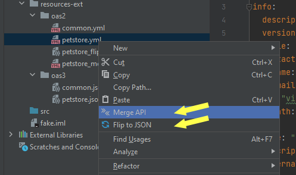

# openapi-utils

## Template ToDo list
- [x] Create a new [IntelliJ Platform Plugin Template][template] project.
- [ ] Get familiar with the [template documentation][template].
- [ ] Verify the [pluginGroup](/gradle.properties), [plugin ID](/src/main/resources/META-INF/plugin.xml) and [sources package](/src/main/kotlin).
- [ ] Review the [Legal Agreements](https://plugins.jetbrains.com/docs/marketplace/legal-agreements.html).
- [ ] [Publish a plugin manually](https://plugins.jetbrains.com/docs/intellij/publishing-plugin.html?from=IJPluginTemplate) for the first time.
- [ ] Set the Plugin ID in the above README badges.
- [ ] Set the [Deployment Token](https://plugins.jetbrains.com/docs/marketplace/plugin-upload.html).
- [ ] Click the <kbd>Watch</kbd> button on the top of the [IntelliJ Platform Plugin Template][template] to be notified about releases containing new features and fixes.

<!-- Plugin description -->
Handy plugin to facilitate working with OAS2/3 specifications. 
- Merge API's back into one Json or Yaml file. 
- Flip to convert the API structure between Yaml or Json format. 
<!-- Plugin description end -->

## UI Integration

## Installation

- Using IDE built-in plugin system:
  
  <kbd>Settings/Preferences</kbd> > <kbd>Plugins</kbd> > <kbd>Marketplace</kbd> > <kbd>Search for "openapi-utils"</kbd> >
  <kbd>Install Plugin</kbd>
  
- Manually:

  Download the [latest release](https://github.com/mortias/openapi-utils/releases/latest) and install it manually using
  <kbd>Settings/Preferences</kbd> > <kbd>Plugins</kbd> > <kbd>⚙️</kbd> > <kbd>Install plugin from disk...</kbd>

---
Plugin based on the [IntelliJ Platform Plugin Template][template].

[template]: https://github.com/JetBrains/intellij-platform-plugin-template
